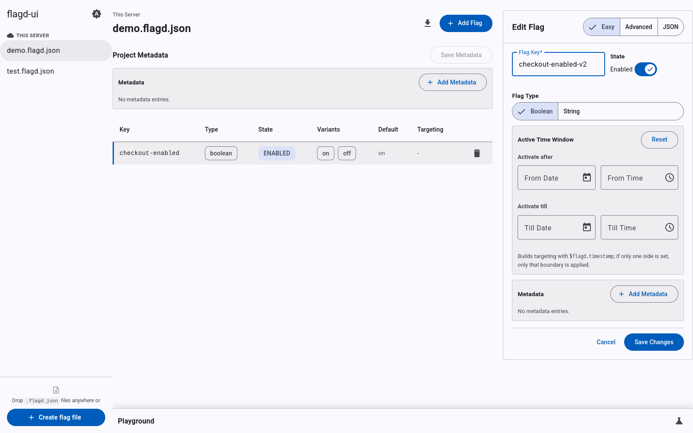

# flagd-ui

`flagd-ui` is a web UI for managing feature flags in OpenFeature `flagd`.

## What is included

- Rust backend built with Axum
- Angular frontend for the UI
- Built-in OpenAPI generation
- Docker and Docker Compose support

## Quick start

Run the app locally:

```bash
cargo run
```

Run with Docker Compose:

```bash
docker compose up --build
```

## Multi-Environment Feature Flag Management

Learn how to manage feature flags across multiple customer deployments and environments:

- **[Options Summary](multi-environment-options-summary.md)** - Compare different approaches for managing flags across environments
- **[Quick Start Guide](multi-environment-quick-start.md)** - Get started with environment-based flags using `$evaluators`
- **[Implementation Plan](multi-environment-implementation-plan.md)** - Detailed technical implementation plan for all options

## UI preview

The screenshot below is generated by a Playwright test during the docs build and shows an open project while editing a flag.


